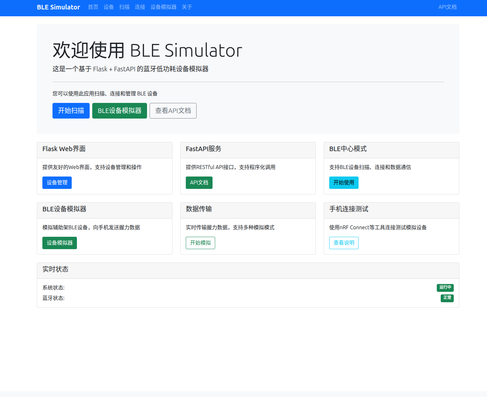
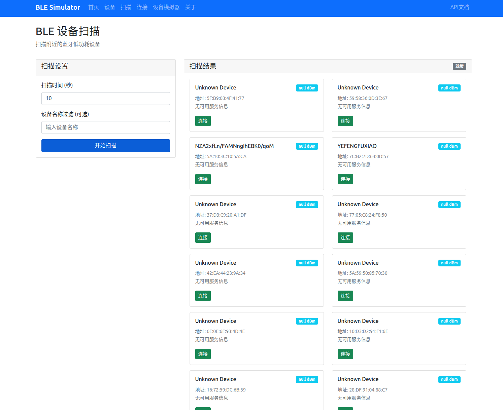
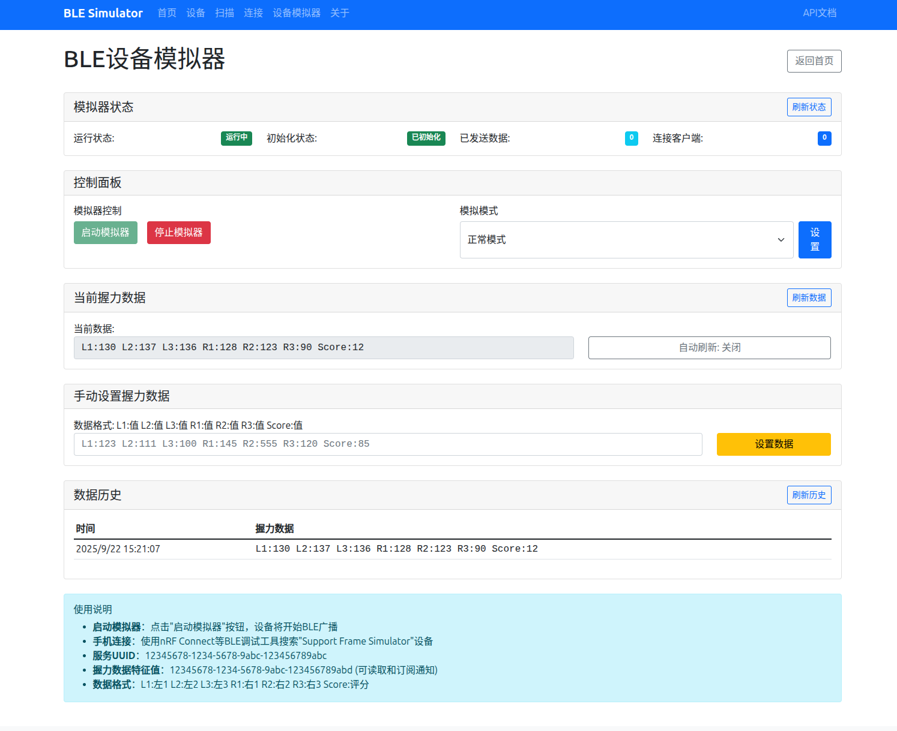
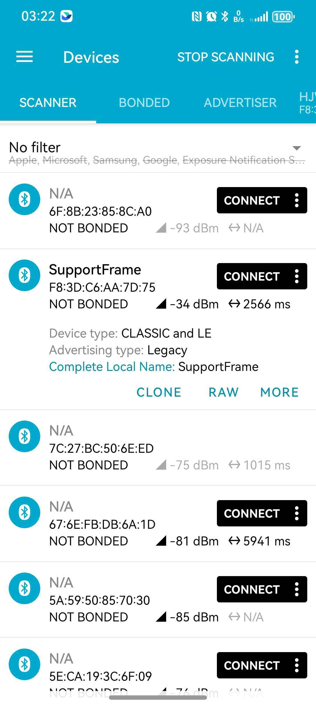
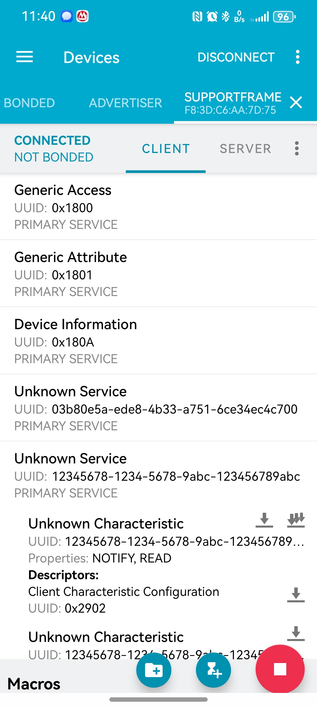
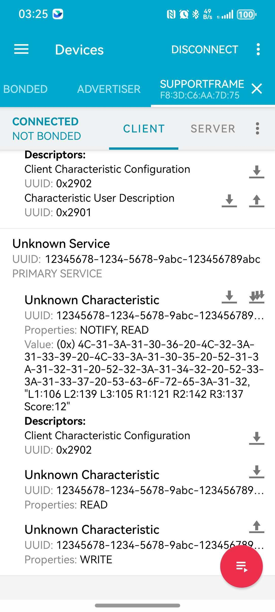

# BLE Simulator - 蓝牙低功耗设备模拟器

这个项目是一个运行在Ubuntu系统上的蓝牙BLE模拟器，具有两个核心功能，通过Web界面实现：


## 🌐 Web应用架构

- **技术栈**: FastAPI + Flask 混合架构
- **FastAPI**: 提供RESTful API接口 (`/api/*`)
- **Flask**: 提供Web用户界面 (`/*`)
- **访问地址**:
  - Web界面: `http://localhost:8000/`
  - API文档: `http://localhost:8000/docs`

## 📋 环境要求

### 系统环境
- **操作系统**: Linux Ubuntu 25.04
- **硬件要求**: 主机必须带蓝牙模块
- **Python版本**: Python 3.13+

### 系统权限
- 需要蓝牙设备访问权限
- 运行时需要root权限

### 验证蓝牙环境
```bash
# 检查蓝牙服务状态
sudo systemctl status bluetooth

# 检查蓝牙适配器
bluetoothctl show

# 检查蓝牙设备
hciconfig
```

## 🚀 部署指导

### 1. 系统依赖安装

执行系统依赖安装脚本：

```bash
cd /path/to/ble_simulator
chmod +x deploy/install_dependencies.sh
./deploy/install_dependencies.sh
```

该脚本将安装：
- Python开发工具 (python3-dev, python3-pip, python3-venv)
- BlueZ蓝牙协议栈 (bluez, bluez-tools, libbluetooth-dev)
- GObject开发库 (libgirepository1.0-dev, pygobject依赖)
- D-Bus开发库 (libdbus-1-dev, dbus)
- 构建工具 (build-essential, pkg-config, cmake)

### 2. Python环境配置

创建并激活虚拟环境：

```bash
# 创建虚拟环境
python3 -m venv .venv

# 激活虚拟环境
source .venv/bin/activate

# 升级pip
pip install --upgrade pip
```

### 3. 安装Python依赖

安装项目所需的Python包：

```bash
# 安装依赖包
pip install -r requirements.txt
```

### 4. 权限配置

使用root权限运行（不推荐，但可用于测试）。

## 🎯 启动应用

### 入口程序

主启动文件位于: `src/python/run_server.py`

### 启动方式

**Root权限运行**

用于测试或权限配置有问题时：

```bash
# 激活虚拟环境
source .venv/bin/activate

# 使用root权限启动
sudo .venv/bin/python src/python/run_server.py
```

### 访问应用

启动成功后，可通过以下地址访问：

- **Web界面**: http://localhost:18080/
- **API文档**: http://localhost:18080/docs
- **健康检查**: http://localhost:18080/api/v1/ble/health

## 🔵 功能1: BLE中心模式 (主机模式)

- **路径**: `/ble/scan`, `/ble/connect`
- **功能**: Web页面控制主机蓝牙适配器
  - 🔍 扫描周围的BLE设备
  - 🔗 连接发现的BLE设备
  - 📱 设备管理和数据通信
- **实现**: `ble_service.py` - 使用BlueZ协议栈作为BLE中心设备

## 🟢 功能2: BLE外围设备模拟器

- **路径**: `/peripheral/simulator`
- **功能**: 将主机蓝牙作为BLE外围设备
  - 📡 广播BLE设备信息 (设备名: "Support Frame Simulator")
  - 🤝 接受其他设备连接(如手机nRF Connect)
  - 📊 模拟握力传感器数据传输
  - ⚙️ 支持多种模拟模式(normal/exercise/rest)
- **实现**: `ble_peripheral_service.py` - GATT服务器 + 广播管理

## 📱 使用指导

### BLE中心模式使用

1. 访问Web界面: http://localhost:8000/
2. 点击"开始扫描"按钮
3. 在扫描页面设置扫描参数（持续时间、设备名过滤等）
4. 查看扫描到的BLE设备列表
5. 选择设备进行连接和数据通信

**页面截图:**





### BLE外围设备模拟器使用

1. 访问Web界面: http://localhost:8000/
2. 点击"BLE设备模拟器"按钮
3. 配置模拟器参数：
   - 设备名称：Support Frame Simulator
   - 模拟模式：normal/exercise/rest
   - 握力数据：手动设置或自动生成
4. 启动模拟器开始广播
5. 使用手机nRF Connect等工具连接测试

**页面截图:**

**开启模拟器**


**nRF Connect扫描页面，找到SupportFrame，就是我们的模拟器**


**连接后，可以看到下面的服务，1234...就是我们的服务**


**点开这个，可以看到我们的数据**


### API接口使用

访问API文档: http://localhost:8000/docs

**主要API端点：**
- `GET /api/v1/ble/health` - 健康检查
- `POST /api/v1/ble/scan` - 扫描BLE设备
- `POST /api/v1/ble/connect` - 连接BLE设备
- `POST /api/v1/peripheral/start` - 启动外围设备模拟器
- `POST /api/v1/peripheral/stop` - 停止外围设备模拟器

## 🎯 应用场景

1. **IoT设备开发**: 测试BLE设备的连接和数据传输
2. **协议学习**: 理解BLE GATT协议和数据交换
3. **握力设备原型**: 模拟健康监测设备的数据传输
4. **手机App开发**: 为BLE相关的移动应用提供测试设备

## 🔧 故障排除

### 常见问题

**1. 蓝牙权限问题**
```bash
# 检查用户是否在bluetooth组
groups $USER

# 如果不在，添加到组
sudo usermod -a -G bluetooth $USER
```

**2. D-Bus权限问题**
```bash
# 检查D-Bus服务
sudo systemctl status dbus

# 重启D-Bus服务
sudo systemctl restart dbus
```

**3. BlueZ服务问题**
```bash
# 检查BlueZ服务
sudo systemctl status bluetooth

# 重启蓝牙服务
sudo systemctl restart bluetooth
```

**4. Python依赖问题**
```bash
# 重新安装依赖
pip install --force-reinstall -r requirements.txt
```

＃ 说明
后来才发现，可以使用nRP Connector手机 应用 ，将手机作为BLE设备，比电脑更方便，具体操作如下 ：
nRF Connect的两种模式

1. Scanner模式 (默认)

- 手机作为BLE中央设备
- 扫描和连接其他BLE设备
- 这是您在截图中使用的模式

2. Advertiser模式 (外围设备模拟器)

- 手机作为BLE外围设备
- 广播自定义的BLE服务和数据
- 可以被其他BLE中央设备发现和连接

如何使用Advertiser模式

在nRF Connect中：

1. 打开nRF Connect应用
2. 切换到"Advertiser"标签页 (通常在底部导航栏)
3. 创建广播配置：
- 添加设备名称
- 配置服务UUID
- 设置特征值和数据
4. 开始广播 - 手机开始作为BLE外围设备广播
5. 被发现 - 其他BLE扫描器可以发现并连接您的手机

测试场景

您可以用两台设备测试：
- 设备A: 运行您的BLE Simulator项目（中央模式）
- 设备B: 手机运行nRF Connect Advertiser模式（外围模式）

这样设备A就可以扫描到设备B的手机，实现完整的BLE通信测试！